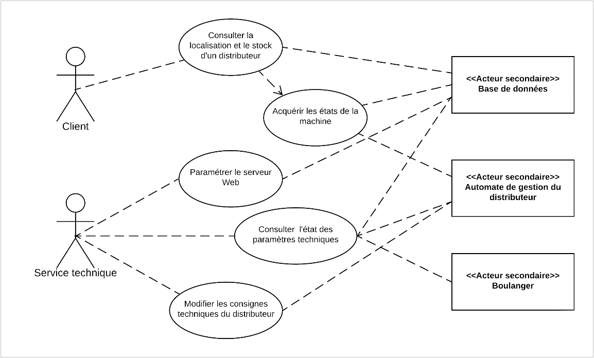

# DistriBag-2024


## Introduction

### Auteurs et contributeurs 

[0xstderr](https://github.com/0xstderr) : Hichem S.

[NewtBest](https://github.com/NewtBest) : Maxime M.

[Raizukio](https://github.com/Raizukio) : Raphaël F.

---------------------------------------------------------------------

### Liens

[Wiki sur Moodle](https://moodle23.lycee-vieljeux.fr/mod/wiki/map.php?pageid=6)

[Dossier partagé sur Lycée Connecté](https://mon.lyceeconnecte.fr/workspace/workspace#/folder/94e38c80-f02c-4b09-bf39-d26b60ccd502)


---------------------------------------------------------------------

### Attribution des tâches

```
Etudiant N° 1 : Hichem S.

Fonctionnalités en charge :
o	Paquetages Acquisition et Transmission : 
o	Accès aux capteurs et au monnayeur périodiquement ou sur évènement
o	Envoi périodique des datas à la classe contrôleur chargée de l’envoi des datas
o	Exploitation de l’API sigfox d’envoi
```

```
Etudiant N° 2 : Raphaël F.

Fonctionnalités en charge :
o	Paquetage Gestion des données :
o	Conception de la base de données DistriBag
o	Implémentation d’une classe d’accès à la base de données en PHP
o	Mise en place et Implémentation d’une fonction de backEnd Sigfox
o	Conception et implémentation d’un docker distribag-db
```

```
Etudiant N° 3 : Maxime M.

Fonctionnalités en charge :
o	Paquetage Site Web de consultation client :
o	Implémentation du site web en PHP/Bootstrap (ou un autre framework adapté)
o	Utilisation de la classe d’accès à la bdd
o	Utilisation d’une API carte type MAPS, OpenStreetMap …
```
---------------------------------------------------------------------

### Date de début de projet

`Le 24 janvier 2024`

---------------------------------------------------------------------

### Objectif du projet

**_L'objectif du projet consiste à développer une application web responsive, accessible à la fois sur ordinateur et sur des appareils portables, permettant de suivre en temps réel l'état des distributeurs de baguettes en milieu ouvert._**

**_Il sera nécessaire de mettre en place des fonctionnalités permettant la visualisation des données des distributeurs, facilitant ainsi l'élaboration de stratégies de gestion des stocks._**

**_De plus, l'application devra permettre d'informer la clientèle sur l'état et la localisation des distributeurs via le site web correspondant._**

---------------------------------------------------------------------

## Contexte

### Pourquoi le projet est-il nécessaire ?

**_La société SOUD OUEST METAL, située à proximité d’Angers, se spécialise dans la fabrication et la commercialisation de distributeurs de baguettes destinés à un usage en extérieur. Ces distributeurs sont conçus pour stocker environ soixante baguettes dans des conditions optimales de fraîcheur, avec une régulation précise de l'hygrométrie et de la température._**

**_Dans une démarche combinant préoccupations écologiques et objectifs commerciaux, la société SOUD OUEST METAL envisage d'étudier la faisabilité de mettre en place un système de rapatriement et d'archivage d'informations. Ce système viserait à fournir une visibilité en temps réel sur l'état de chaque distributeur, permettant ainsi l'élaboration de stratégies de gestion des stocks basées sur des statistiques générées à partir de ces données. De plus, l'entreprise souhaite informer sa clientèle sur l'état et la localisation de ses distributeurs, en utilisant soit un site web dédié, soit une application smartphone._**

---------------------------------------------------------------------

### Conditions et contraintes

**_Absence éventuelle de réseau GSM_**

**_Absence éventuelle de ligne fixe_**

---------------------------------------------------------------------


## Architecture

### Cahier des charges

```
L’application consiste :
-	A acquérir les informations d’état du distributeur, par le biais d’une communication (non encore définie) avec le système électronique de gestion de l’appareil.
-	A formater les informations extraites selon le protocole attendu par le module de communication.
-	A utiliser l’API du module de communication pour transférer les datas vers le BackEnd adéquat
-	A développer une interface PHP de récupération des datas au serveur BackEnd 
-	A développer un site WEB client permettant la visualisation de la localisation des distributeurs et de leur stock
-	(A développer un site WEB technique permettant la visualisation des états des distributeurs dans le temps)
-	A mettre en œuvre un serveur de base de données
-	A implémenter une interface PHP d’accès à la base de données pour les sites Client (et Techniques)
```

---------------------------------------------------------------------

### Diagrammes

**_Diagramme de cas d'utilisation_**


---------------------------------------------------------------------

### Description des composants principaux et de leurs interactions

`à compléter...`

---------------------------------------------------------------------
